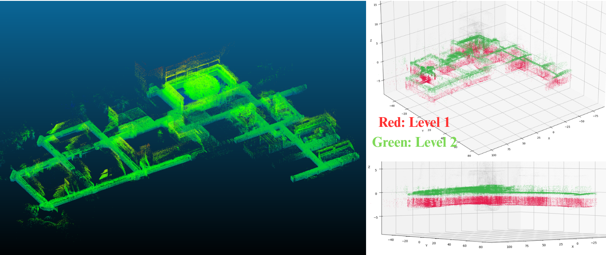
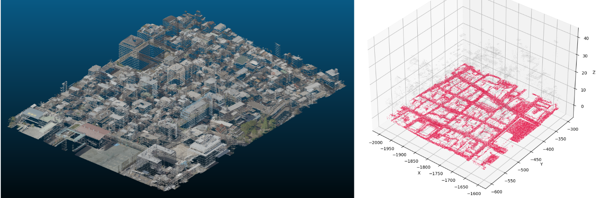
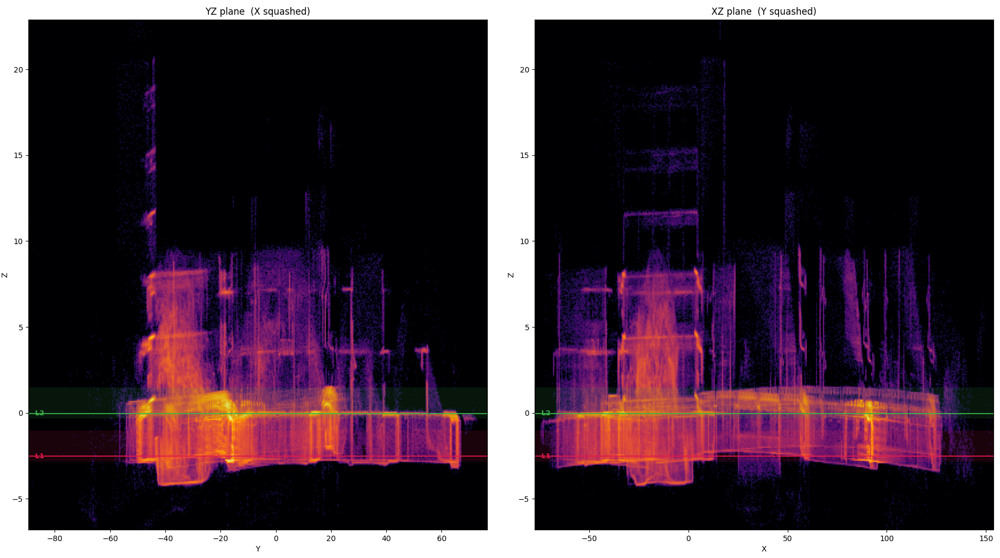
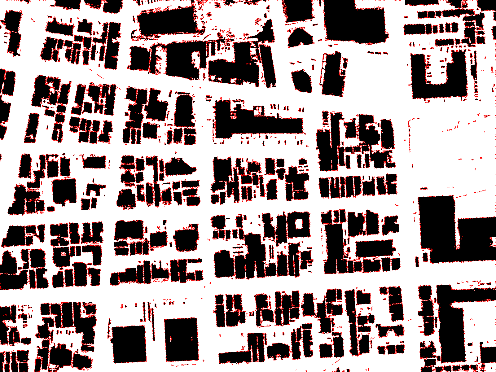
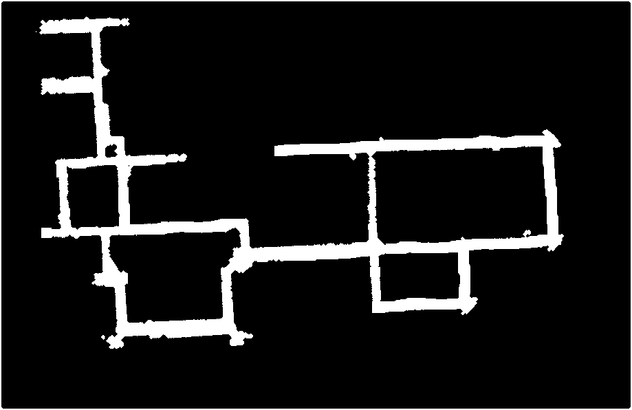
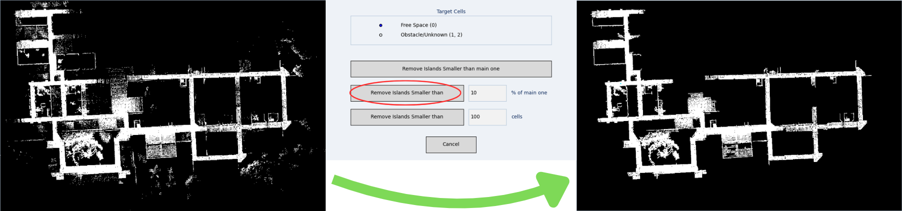
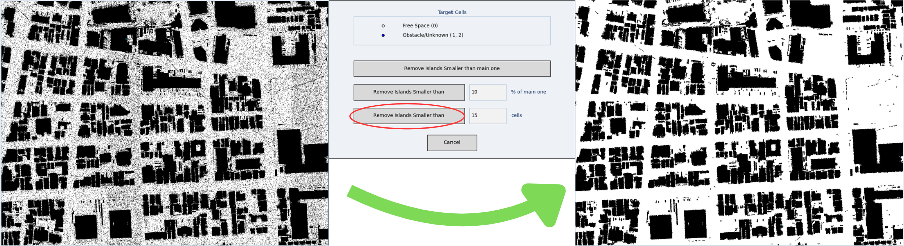

# Point Cloud Plane Level Detector
This program's goal is to identigy the levels inside a point cloud and extract them as new point clouds so that we can process each level individually, for making 2D occupancy maps, for example.

The goal here is not to be the most robust algorithm, but to be a simple one just to get started with the form of your occupancy grid, thats the reasson the editing tool is present, so that you can refine the results.

This method has proven to be a good middle ground, as it's simplicity brings ease of use and agility, although at the cost of robustness, reliability and reproducibility , but for practical cases, just to get a good occupancy grid for testing, this is a good alternative. 

## Results Examples

### Level Finding
This algorithm works way better for well structured, completely horizontal and plane environments, like apartments, buildings, and warehouses.

* DCC and ICEX building at UFMG(mapped only done from the second floor). Original point cloud and selected point cloud points for each level and heat maps showing the cross section for the levels:



* Results using Tokyo's ward, Koto, point cloud



* Example of heat map from the DCC ICEX cloud, showing the levels found



### Grid Making
This program takes the level point cloud from the above program and turns into a sketch of a grid map from it, classifying cells as occupied or free.

* Grid map from Koto ward




* Grid map from DCC and ICEX



## How to use it
* Clone the repo:
```
git clone https://github.com/vtortega/Simple-Occupancy-Grid-from-Point-Cloud.git
```

### Level Finding

* Decide which parameters/flags to use:
    * `--fit_plane` Fits a plane to the point cloud and aligns it with it. This is better when you have a flat point cloud, and bad if you have a tall point cloud and want to get horizontal planes(like in a 30-story building), for that you would be better off doing the allignement separetely and not passing the flag.
    * `--num_levels (int)` Sets the number of planes present: the algorithm will take the planes with the most points(see "Attention Points" section). Its worth setting it to +1 or +2 the number of planes you actually want from the cloud.
    * `--threshold (%)` After all histogram peaks are found, each candidate level is scored by how many points fall inside its
   slab. The level with the most points sets the reference. Any candidate whose count is below threshold
   × reference_count is discarded. `0.5` is the default, so if any level has less than half the number of points, its discarted.
    * `--below (meters)` After the planes are found, this sets the distance in which points **below** the point cloud will be included in the level cloud(This is not symmetric as the line is fitted to the floor/ceiling of the level)
    * `--above (meters)` After the planes are found, this sets the distance in which points **above** the point cloud will be included in the level cloud

* Run the program with the desired `.pcd` file path(**only binary `.pcd` files**). E.g.:
```
python3 visualize_levels.py ./data/gravity_aligned_icex.pcd --threshold 0.7 --below 0.5 --above 2.0
```

### Grid Making
The automatic occupancy grid generated is not refined at all, that's why there is a manual inspection and modification step in which you can paint cells as occupied or not, soften the map, change the cell size and, finally, save the resulting `.png` file.

* Just run the program with the desired point cloud from the level you prefer(It will be saved to the `grids` folder):
```
python3 make_occupancy_grid.py ./point_clouds/gravity_aligned_icex_L2.pcd
```

* You have a few important tools on the program:
    * Tool: Paint vs Bucket(Classical Paint functionalities)
    * Cell: If you will mark the clicked cells as occupied or as free.
    * Shape: Shape of the Paint brush you are using, square or round.
    * Brush size: pixel size of the brush.
    * Cell Size: the size of the cells on the grid. You can change this whenever you want
    * Soften: Automatically removes some isolated points and tries to round up the map. Good for a initial clearing of the cloud and to refine it a little(This algorithm deserver a little more attention and tunning)
    * Save and Quit: Saves the grid map as `.png` on the `grids` directory(with the same name as the `.pcd` files passed when running the program) and quits the application.
    * Frontier Layer: Considers every unkown cell that touches a free cell an obstacle, painting it as red.
    * Remove Islands: Remove isolated free or obstacle cells. 3 options of removal are available: Removing all islands smaller then the biggest one, removing all islands proportianally smaller than the biggest one and removing islands by size:
    
        Pay attention to what kind of grid you are removing, below there are 2 examples, one removing free space and the other removing obstacle/unkown spaces, respectively:

    
    


## How it Works

It works by using the histogram method.

The allignement of the point cloud is important for the algorithm. A point cloud tilted 30 degrees will yield different results from the same cloud gravity or plane alligned, that's why this algorithm provides a plane fit step(If you feel like you have a better alligned method, feel free to use it and not pass the plane `--fit_plane` parameter).

After the collapsing of the cloud is done(X and Y collapsed), a plane is fited considering the heat line resulting: heat regions are those where, on the Z axis, there were more points on that hight, which usually means a plane.

With the best plane to each heat region is done, points from the cloud near the found plane are selected to be used on the resulting point cloud

The grid is made in a similar way, but by collapsing the Z axis.It counts the number of points falling into each cell and normalizes these counts against the highest density cell in the entire map. To determine if a cell is free or occupied, a sigmoid function is applied to its normalized density using two parameters: a midpoint (the density threshold distinguishing free space from occupied space) and steepness (how sharply the transition occurs). If the resulting probability is 0.5 or greater, the cell is marked as occupied

## Attention Points

* Usually, with lidar like the MID360, the level with the most points in a scan of a single level will be the ceiling of the level, so the `--num_levels 1` will end up selecting the ceiling instead of the floor. For this case it's recommended to use the `2` instead of `1` for the parameter value, so that the `L2` will be the floor you actually want. On the other side, if the scan was used using a drone, defining points of the major plane would be the actual floor, so L1 would probably be the correct one to use. But since the algorithm is so fast and shows visualizations of the selected points and planes, it can be worthwhile to test multiple parameters.

* In the case of a top down scan, like the one made from drones, in which you just want the ground plane, you can pass a higher `--below` argument, as there won't be any points below the actual ground, so you will be able to select a bigger area of the ground, like small inclinations and such.

# Sources

[Really Cool Point Clouds from Tokyo](https://info.tokyo-digitaltwin.metro.tokyo.lg.jp/3dmodel/)